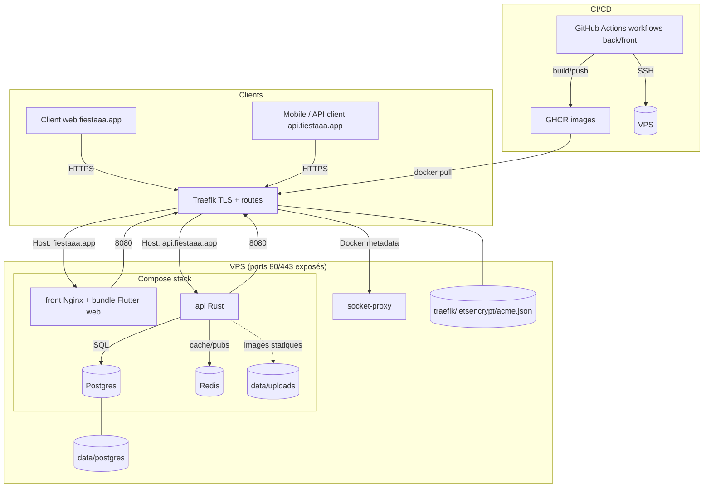

# Déploiement infra (VPS) et CI/CD

Documentation opérationnelle pour déployer les projets `fiestaaa_back` (API Rust) et `fiestaaa_front` (front Flutter web) sur un VPS à l'aide de Docker, Traefik et GitHub Actions (GHCR).

- Stack de prod décrite dans `fiestaaa_back/docker-compose.prod.yml` (Traefik + socket-proxy + Postgres + Redis + API + Front).
- Pipeline CI existante côté backend : `fiestaaa_back/.github/workflows/deploy.yml`.
- Registre d'images : `ghcr.io/theopeuchlestrade/{fiestaaa_back,fiestaaa_front}` (tag `latest` + tag SHA).
- En cas de compromission ou de doute sur le VPS / les secrets : suivre aussi `fiestaaa_back/docs/incident-securite.md`.
- En cas de passage futur des repos vers `public + GitHub Free` : suivre `fiestaaa_back/docs/passage-public-open-source.md`.

## Principes de sécurité

- Les secrets de prod sont stockés dans GitHub Actions et matérialisés sur le VPS dans `~/apps/fiestaaa/.env` et `~/apps/fiestaaa/data/service-account.json` avec des permissions strictes. Les `.env.prod` locaux ne sont pas la source de vérité de la prod.
- Les workflows de déploiement doivent utiliser l'environnement GitHub `production`, avec secrets d'environnement, branches autorisées et approbation manuelle si possible.
- Le front ne reçoit plus les secrets runtime du backend : sa configuration publique est injectée uniquement au build.
- Traefik n'accède plus directement à `/var/run/docker.sock` ; il passe par un proxy Docker en lecture limitée.
- `FCM_SERVER_KEY` est optionnelle et ne sert qu'au fallback FCM legacy. Le chemin recommandé est FCM HTTP v1 avec `service-account.json`.
- Les PRs doivent passer un `dependency review`, et les images poussées sur GHCR doivent être accompagnées d'une attestation de provenance.
- Tant que les repos restent `privés + GitHub Free`, certaines protections préparées dans les workflows resteront inactives côté GitHub. Voir `fiestaaa_back/docs/passage-public-open-source.md` pour le basculement futur vers `public + Free`.

## Vue d'ensemble de l'architecture



### Composants clés
- Traefik : reverse-proxy unique, TLS (Let’s Encrypt), routes `fiestaaa.app` → service `front`, `api.fiestaaa.app` → service `api`.
- socket-proxy : exposition limitée et en lecture seule de l’API Docker à Traefik, sur un réseau Docker interne dédié ; le socket Docker n’est plus monté directement dans Traefik.
- front : conteneur Nginx servant le bundle Flutter web (port 8080 interne, exposé à Traefik via labels), sans secrets runtime du backend.
- api : conteneur Rust (port 8080 interne), dépend de Postgres et Redis.
- Postgres + volume persistant `data/postgres`; Redis sans persistance (config actuelle).
- Uploads avatars : volume `data/uploads` monté dans le conteneur API (exposé via `AVATAR_BASE_URL`, servi par l'API).
- Certificats Traefik : `traefik/letsencrypt/acme.json` (chmod 600).
- CI/CD : workflows GitHub Actions (back/front) buildent et poussent les images sur GHCR puis déploient via SSH (`docker compose pull/up`). Le push d’image utilise `GITHUB_TOKEN`; le VPS n’a besoin que d’un `GHCR_TOKEN` en lecture.
- Arborescence VPS : `~/apps/fiestaaa` avec `docker-compose.yml`, `data/`, `traefik/`, `data/service-account.json`, et optionnel `frontend/` pour éventuels overrides.

## 1) Préparer le VPS

1. **Accès**
	- Confirmer l'IP du serveur et les DNS (`fiestaaa.app`, `api.fiestaaa.app` pointent sur le VPS pour que Traefik puisse générer les certificats).
	- Vérifier l'accès SSH : `ssh <user>@<ip>`.
2. **Dépendances système**
	```bash
	sudo apt update
	sudo apt upgrade
	sudo apt install docker.io docker-compose-plugin  # Compose V2 (requis)
	# Si docker-compose v1 (python) est déjà installé, le retirer pour éviter le bug "KeyError: 'ContainerConfig'"
	sudo apt purge -y docker-compose || true
	sudo usermod -aG docker ${USER}  # puis reconnectez-vous
	```
	> Si `docker-compose-plugin` n'existe pas dans vos dépôts (ex. images cloud minimales), ajoutez le repo officiel Docker :  
	> ```
	> sudo apt-get update
	> sudo apt-get install -y ca-certificates curl gnupg
	> sudo install -m 0755 -d /etc/apt/keyrings
	> curl -fsSL https://download.docker.com/linux/$(. /etc/os-release && echo "$ID")/gpg | sudo gpg --dearmor -o /etc/apt/keyrings/docker.gpg
	> echo "deb [arch=$(dpkg --print-architecture) signed-by=/etc/apt/keyrings/docker.gpg] https://download.docker.com/linux/$(. /etc/os-release && echo "$ID") $(. /etc/os-release && echo "$VERSION_CODENAME") stable" | sudo tee /etc/apt/sources.list.d/docker.list >/dev/null
	> sudo apt-get update
	> sudo apt-get install -y docker-ce docker-ce-cli containerd.io docker-buildx-plugin docker-compose-plugin
	> ```
3. **Utilisateur de déploiement (recommandé)**
	```bash
	sudo adduser deploy
	sudo usermod -aG docker deploy
	```
4. **Clés SSH pour GitHub Actions**
	- Depuis le VPS (ou votre machine), générer une clé dédiée :  
		`ssh-keygen -t rsa -b 4096 -C "github-actions" -f /home/<user>/.ssh/deploy_key`
	- Ajouter la clé publique au serveur :  
		`cat /home/<user>/.ssh/deploy_key.pub >> /home/<user>/.ssh/authorized_keys && chmod 600 /home/<user>/.ssh/authorized_keys`
5. **Port SSH non standard (recommandé)**
	```bash
	SSH_PORT=2222  # adaptez la valeur
	echo "Port ${SSH_PORT}" | sudo tee /etc/ssh/sshd_config.d/60-fiestaaa-port.conf >/dev/null
	# Ubuntu 24.04+ peut utiliser ssh.socket par défaut ; repassez sur ssh.service
	# pour que la directive Port soit appliquée de façon prévisible.
	sudo rm -f /etc/systemd/system/ssh.service.d/00-socket.conf
	sudo rm -f /etc/systemd/system/ssh.socket.d/addresses.conf
	sudo systemctl disable --now ssh.socket
	sudo systemctl daemon-reload
	sudo systemctl enable --now ssh.service
	sudo /usr/sbin/sshd -t
	sudo systemctl restart ssh
	sudo ss -ltnp | grep ":${SSH_PORT}"
	```
	- Gardez la session SSH courante ouverte tant qu'une seconde connexion `ssh -p <ssh_port> <user>@<ip>` n'a pas été validée.
	- Mettez aussi à jour votre `~/.ssh/config` local si vous utilisez un alias SSH.
	- Si `ssh -p <ssh_port> ...` est refusé alors que `ssh -p 22 ...` fonctionne encore, c'est généralement `ssh.socket` qui écoute toujours sur 22 : la séquence ci-dessus bascule volontairement vers `ssh.service` pour éviter ce comportement.
	- Changer le port réduit surtout le bruit des scans automatisés ; cela ne remplace pas les clés SSH, UFW et Fail2ban.
6. **Pare-feu**
	```bash
	sudo apt install -y ufw
	sudo ufw allow <ssh_port>/tcp
	sudo ufw allow 80,443/tcp
	sudo ufw enable
	```
	Si vous aviez déjà ouvert `22/tcp`, supprimez la règle après validation de la nouvelle connexion : `sudo ufw delete allow 22/tcp`.
7. **Fail2ban (protection brute-force SSH)**
	```bash
	sudo apt install -y fail2ban
	sudo systemctl enable --now fail2ban
	```
	Configuration de base (adapter `ignoreip` et le port SSH si besoin) :
	```bash
	sudo tee /etc/fail2ban/jail.local >/dev/null <<'EOF'
	[DEFAULT]
	bantime = 1h
	findtime = 10m
	maxretry = 5
	ignoreip = 127.0.0.1/8 ::1 <votre_ip_fixee>

	[sshd]
	enabled = true
	port = <ssh_port>
	backend = systemd
	banaction = ufw
	EOF
	sudo systemctl restart fail2ban
	```
	`ignoreip` est la liste des IPs/réseaux jamais bannis (séparés par des espaces). Ajoutez votre IP publique/VPN d'administration, et évitez `0.0.0.0/0` qui désactive la protection.
	Vérifications utiles :
	```bash
	sudo fail2ban-client status
	sudo fail2ban-client status sshd
	sudo tail -f /var/log/fail2ban.log
	```
	Si vous conservez finalement le port 22, remplacez `port = <ssh_port>` par `ssh` ou `22`.

## 2) Préparer l'arborescence sur le VPS

Les commandes ci-dessous supposent un dossier `/home/<user>/apps/fiestaaa` (ajustez si besoin) et que l'action GitHub se connecte avec cet utilisateur.
Copiez au préalable le `docker-compose.prod.yml` du repo vers le VPS (git clone sur le serveur ou `rsync` depuis votre machine).

```bash
mkdir -p ~/apps/fiestaaa/{frontend,data/postgres,data/uploads,traefik/letsencrypt}
cp fiestaaa_back/docker-compose.prod.yml ~/apps/fiestaaa/docker-compose.yml
touch ~/apps/fiestaaa/traefik/letsencrypt/acme.json && chmod 600 ~/apps/fiestaaa/traefik/letsencrypt/acme.json
```

- **COMPOSE_FILE attendu** : le workflow lance `docker compose ...` sans `-f`, d'où le renommage en `docker-compose.yml`.
- **Secrets runtime (.env)** : le workflow CI générera le `.env` sur le serveur à partir des secrets GitHub (voir section suivante). Ce fichier reste en clair sur le VPS ; gardez-le en `chmod 600` et réservez l'accès SSH à l'admin/deploy. Si vous avez des exigences plus élevées, remplacez ce mécanisme par Docker secrets, SOPS/age ou un secret manager. Pour un premier run manuel, créez-le avec les placeholders :

	```bash
	cat > ~/apps/fiestaaa/.env <<'EOF'
	# Base de données et cache
	POSTGRES_USER=...
	POSTGRES_PASSWORD=...
	POSTGRES_DB=...
	DATABASE_URL=postgres://<user>:<pass>@db:5432/<db>
	REDIS_URL=redis://redis:6379
	DATA_ENCRYPTION_KEY=...
	DATA_LOOKUP_KEY=...
	# Important : dans le réseau Docker Compose, utilisez le hostname du service
	# Redis ("redis") et non localhost ; 6379 est le port par défaut.
	# API
	JWT_SECRET=...
	APP_BASE_URL=https://fiestaaa.app
	AVATAR_BASE_URL=https://api.fiestaaa.app/media/avatars
	CORS_ALLOWED_ORIGINS=https://fiestaaa.app,https://www.fiestaaa.app
	ADMIN_EMAILS=admin@fiestaaa.app
	# Email / push (adapter selon besoins)
	INVITATION_EMAIL_SENDER="Fiestaaa <no-reply@fiestaaa.app>"
	RESEND_API_KEY=...
	# Optionnel : uniquement si vous gardez un fallback FCM legacy
	FCM_SERVER_KEY=
	FIESTAAA_FCM_VAPID_KEY=...
	FCM_PROJECT_ID=...
	FIESTAAA_GOOGLE_WEB_CLIENT_ID=...
	FIESTAAA_GOOGLE_ANDROID_CLIENT_ID=...
	FIESTAAA_GOOGLE_IOS_CLIENT_ID=...
	FIESTAAA_APPLE_APP_ID=...
	FIESTAAA_APPLE_SERVICE_ID=...
	FIESTAAA_APPLE_REDIRECT_URI=...
	FCM_SERVICE_ACCOUNT_PATH=/app/service-account.json
	EOF
	```

- **Fichier de service Firebase** : placez le JSON dans `~/apps/fiestaaa/data/service-account.json` (non versionné, monté en read-only dans le conteneur API) et appliquez `chmod 600 ~/apps/fiestaaa/data/service-account.json`.
- **Données persistantes** :
	- Postgres : `./data/postgres` (volume `db`).
	- Uploads avatars : `./data/uploads` (volume monté sur `/data/uploads` par `api`).
	- Certificats : `./traefik/letsencrypt/acme.json`.

## 3) Premier démarrage manuel (optionnel)

Depuis `~/apps/fiestaaa` :
```bash
docker compose pull        # récupère les images ghcr.io/theopeuchlestrade/fiestaaa_back et fiestaaa_front
docker compose up -d       # lance traefik, db, redis, api, front
docker compose ps          # vérifie les statuts
docker compose logs -f api # debug si besoin
```

## 4) CI/CD GitHub Actions (backend)

Workflow : `fiestaaa_back/.github/workflows/deploy.yml`
- Déclencheurs : push sur `main` ou `master`, ou `workflow_dispatch`.
- Environnement GitHub recommandé : `production`
- Jobs :
	1. Vérifie la présence des secrets requis.
	2. `docker login` sur GHCR (`ghcr.io`) avec `GITHUB_TOKEN` côté runner.
	3. Build et push l'image `ghcr.io/theopeuchlestrade/fiestaaa_back:${{ github.sha }}` + `latest` (sauf si déjà présente).
	4. Génère une attestation de provenance GitHub liée à l'image GHCR publiée.
	5. Connexion SSH au VPS (appleboy/ssh-action) puis :
		- Génère `.env` sur le serveur avec les secrets GitHub pour le runtime Docker Compose, `TRUST_PROXY_HEADERS=true` et `API_IMAGE_TAG=${{ github.sha }}`.
		- Préserve le `FRONT_IMAGE_TAG` déjà déployé pour éviter un rollback implicite du front.
		- `docker compose pull api && docker compose up -d --no-deps api && docker compose ps` (le reste de la stack doit déjà être présent grâce au compose prod).
	6. Exécute un smoke check public bloquant sur `https://api.fiestaaa.app/health` et `https://fiestaaa.app`.
- Workflow PR recommandé : `fiestaaa_back/.github/workflows/dependency-review.yml`. Tant que le repo reste `privé + GitHub Free`, il doit skipper proprement ; l'action GitHub n'est réellement disponible qu'une fois le repo public ou le plan GitHub relevé.

### Secrets à ajouter dans GitHub (Settings > Secrets and variables > Actions)

Nom | Description
--- | ---
`JWT_SECRET` | Secret JWT (32+ chars)
`VPS_HOST` | IP ou hostname du VPS
`VPS_PORT` | Port SSH du VPS (renseignez la valeur configurée dans `sshd`, ex. `2222`)
`VPS_USER` | Utilisateur de déploiement (ex. `deploy`)
`VPS_SSH_KEY` | Contenu de la clé privée `deploy_key` (sans passphrase)
`GHCR_TOKEN` | PAT GitHub minimal avec `read:packages` pour le `docker login` côté VPS
`DATABASE_URL` | URL Postgres utilisée par l'API (ex. `postgres://<user>:<pass>@db:5432/<db>`)
`REDIS_URL` | URL Redis (ex. `redis://redis:6379`, ne pas utiliser `localhost` dans Docker)
`DATA_ENCRYPTION_KEY` | Clé de chiffrement des données sensibles en base, 32 caractères minimum
`DATA_LOOKUP_KEY` | Clé HMAC utilisée pour les blind indexes / lookups, 32 caractères minimum
`POSTGRES_USER` / `POSTGRES_PASSWORD` / `POSTGRES_DB` | Variables Postgres utilisées par le service `db`
`APP_BASE_URL` | URL publique du front (ex. `https://fiestaaa.app`)
`CORS_ALLOWED_ORIGINS` | Liste des origines autorisées (séparées par virgules)
`AVATAR_BASE_URL` | URL publique des avatars (ex. `https://api.fiestaaa.app/media/avatars`)
`AVATAR_UPLOAD_DIR` | Chemin des uploads dans le conteneur API (ex. `/data/uploads/avatars`)
`INVITATION_EMAIL_SENDER` | Expéditeur des emails d'invitations
`RESEND_API_KEY` | Clé d'email Resend
`FCM_SERVER_KEY` | (optionnel) Clé serveur FCM legacy ; laissez vide si vous utilisez FCM HTTP v1 avec `service-account.json`
`FIESTAAA_FCM_VAPID_KEY` | VAPID public key (web push) — réutilisée par le front
`FCM_SERVICE_ACCOUNT_PATH` | Chemin vers la clé de service (ex. `/app/service-account.json`)
`FCM_PROJECT_ID` | ID du projet Firebase
`NOTIFICATION_DEDUP_TTL_SECONDS` | TTL de déduplication des notifications (ex. 300)
`FIESTAAA_GOOGLE_WEB_CLIENT_ID` | Client ID Google OAuth web
`FIESTAAA_GOOGLE_ANDROID_CLIENT_ID` | (optionnel) Client ID Google OAuth Android
`FIESTAAA_GOOGLE_IOS_CLIENT_ID` | Client ID Google OAuth iOS
`FIESTAAA_APPLE_APP_ID` | (optionnel) Bundle ID iOS/macOS pour vérifier les tokens Apple natifs
`FIESTAAA_APPLE_SERVICE_ID` / `FIESTAAA_APPLE_REDIRECT_URI` | OAuth Apple (web) — requis si vous voulez afficher le bouton Apple (transmis dans le `.env` généré)
`ADMIN_EMAILS` | (optionnel) Liste d'emails admin séparés par des virgules

> Les valeurs front (VAPID, FCM project, client Google) sont partagées : renseignez les mêmes secrets dans le repo `fiestaaa_front` pour la build du bundle web.

### Protection GitHub recommandée

- Créez un environnement `production` dans GitHub sur les repos `fiestaaa_back` et `fiestaaa_front`.
- Déplacez les secrets de prod vers les `environment secrets` de `production`.
- Une fois les repos publics, protégez `main` et rendez obligatoires au minimum :
  - `Backend CI` sur `fiestaaa_back/.github/workflows/ci.yml`
  - `Frontend CI` sur `fiestaaa_front/.github/workflows/ci.yml`
  - `Dependency Review`
- Tant que les repos restent `privés + GitHub Free`, `Dependency Review` doit rester présent mais se contenter d'un skip explicite ; l'action GitHub n'est pas disponible dans cette configuration.
- Ajoutez au minimum :
  - une restriction aux branches de déploiement (`main` / `master` selon le repo) ;
  - un ou plusieurs `required reviewers` avant exécution ;
  - si utile, un `wait timer` pour éviter un déploiement immédiat après merge.
- Activez également `secret scanning`, `push protection`, `dependency graph`, `Dependabot alerts` et `Dependabot security updates`.

### Attendus côté VPS pour que la CI fonctionne
- Le répertoire cible (`~/apps/fiestaaa`) contient `docker-compose.yml` (copie de `docker-compose.prod.yml`) et les dossiers `data/`, `traefik/`.
- L'utilisateur défini dans `VPS_USER` peut lancer `docker compose` sans sudo et dispose de Compose V2 (plugin). Éviter `docker-compose` v1 (bug connu `KeyError: 'ContainerConfig'` avec Docker récents).
- La clé publique associée à `VPS_SSH_KEY` est dans `~/.ssh/authorized_keys`.
- Si SSH écoute sur un port non standard, `VPS_PORT` côté GitHub Actions correspond à ce port et celui-ci est autorisé par UFW.
- `~/apps/fiestaaa/.env`, `~/apps/fiestaaa/data/service-account.json` et `~/apps/fiestaaa/traefik/letsencrypt/acme.json` sont en `chmod 600`.

### Validation
- Push sur `main` ➜ vérifier que le job "Build and Deploy" passe au vert.
- Sur le VPS : `docker compose ps` puis tester les URLs `https://fiestaaa.app` et `https://api.fiestaaa.app/health` après le déploiement. En cas de souci, utilisez `docker compose logs -f api` et `docker compose logs -f front`.

## 5) Frontend (fiestaaa_front)

- Le compose prod attend des images immuables :
  - `ghcr.io/theopeuchlestrade/fiestaaa_back:${API_IMAGE_TAG}` pour l'API
  - `ghcr.io/theopeuchlestrade/fiestaaa_front:${FRONT_IMAGE_TAG}` pour le front
  Les workflows conservent un fallback `latest`, mais écrivent désormais les tags SHA dans `~/apps/fiestaaa/.env` pour rendre les déploiements et rollbacks auditables.
- Workflow GitHub : `fiestaaa_front/.github/workflows/deploy.yml`
	- Environnement GitHub recommandé : `production`
	- Étapes : vérifie les secrets ➜ login GHCR ➜ build + push image (tags `${{ github.sha }}` + `latest`) ➜ attestation de provenance GHCR ➜ SSH VPS ➜ mise à jour de `FRONT_IMAGE_TAG` dans `~/apps/fiestaaa/.env` en préservant `API_IMAGE_TAG` ➜ `docker compose pull front && docker compose up -d --no-deps front && docker compose ps` ➜ smoke checks publics.
	- `~/apps/fiestaaa/frontend` : dossier optionnel (pas de volume monté). Vous pouvez le créer pour héberger d'éventuels overrides Nginx ou archives, mais le conteneur front est autonome.
- Secrets à créer sur le repo `fiestaaa_front` (Settings > Secrets and variables > Actions) :
	- Accès VPS / registre : `VPS_HOST`, `VPS_PORT` (port SSH configuré sur le VPS), `VPS_USER`, `VPS_SSH_KEY`, `GHCR_TOKEN` (PAT minimal `read:packages` pour le pull sur le VPS).
	- Dart defines / Firebase / OAuth : `FIESTAAA_API_BASE_URL`, `FIESTAAA_GOOGLE_WEB_CLIENT_ID`, `FIESTAAA_APPLE_SERVICE_ID`, `FIESTAAA_APPLE_REDIRECT_URI`, `FIESTAAA_FCM_VAPID_KEY`, `FIREBASE_PROJECT_ID`, `FIREBASE_STORAGE_BUCKET`, `FIREBASE_MESSAGING_SENDER_ID`, `FIREBASE_WEB_API_KEY`, `FIREBASE_WEB_APP_ID`, optionnels `FIREBASE_WEB_MEASUREMENT_ID`, `FIREBASE_AUTH_DOMAIN` (sinon `${project}.firebaseapp.com`).
	- Partage de secrets avec le backend : `FIESTAAA_FCM_VAPID_KEY`, `FIESTAAA_GOOGLE_WEB_CLIENT_ID`, `FIREBASE_*`/`FCM_PROJECT_ID` doivent correspondre aux valeurs du backend pour que les notifications et OAuth fonctionnent.
- Les valeurs ci-dessus sont injectées au build (visibles dans le bundle web, normal pour un front public).
- Déploiement : le `docker-compose.yml` déjà en place contient le service `front`, aucune config supplémentaire côté VPS. Le conteneur `front` ne charge plus le `.env` de prod au runtime.
- Workflow PR recommandé : `fiestaaa_front/.github/workflows/dependency-review.yml` pour bloquer l'introduction de dépendances vulnérables avant merge. Tant que le repo reste `privé + GitHub Free`, il doit skipper proprement ; l'action GitHub n'est réellement disponible qu'une fois le repo public ou le plan GitHub relevé.
- Workflow CI PR : `fiestaaa_back/.github/workflows/ci.yml` pour le back (`cargo fmt`, `clippy`, suite complète `cargo test --locked --all-targets --jobs 1 -- --test-threads=1`) et `fiestaaa_front/.github/workflows/ci.yml` pour le front (`flutter gen-l10n`, `dart format`, `flutter analyze`, `flutter test`).

## 6) Vérifications runtime

- Santé API : `curl -vk https://api.fiestaaa.app/health` (passe par Traefik).
- Healthcheck base : `docker compose exec db pg_isready -U ${POSTGRES_USER}`.
- Healthchecks conteneurs : `api` vérifie `http://127.0.0.1:8080/health`, `front` vérifie `http://127.0.0.1:8080/`.
- CORS : autorisations côté API via `CORS_ALLOWED_ORIGINS` (`https://fiestaaa.app,https://www.fiestaaa.app` en prod).
- Front : `curl -I https://fiestaaa.app`.
- Stack up : `docker compose ps` (`socket-proxy`, `traefik`, `api`, `front`, `redis` doivent être Up, `db` healthy).
- Logs : `docker compose logs -f api`, `docker compose logs -f front`, `docker compose logs -f traefik`.

## 7) Sauvegardes et reprise

- Base de données : mettez en place un `pg_dump` régulier ou un snapshot de `data/postgres`, avec rétention et test de restauration.
- Uploads : sauvegardez `data/uploads`.
- Certificats : sauvegardez `traefik/letsencrypt/acme.json`.
- Secrets : conservez une copie hors-VPS des valeurs GitHub Actions, du `service-account.json`, des keystores mobiles et des identifiants Apple/Google/Resend dans un coffre de secrets.
- Reprise : testez périodiquement un redéploiement complet sur une machine vierge ou un nouveau VPS ; une sauvegarde non restaurée n’est pas une sauvegarde fiable.

### Monitoring minimum

- Ajoutez au minimum deux checks externes avec alertes :
  - `https://fiestaaa.app`
  - `https://api.fiestaaa.app/health`
- Vérifiez après chaque déploiement que ces checks passent depuis l’extérieur ; les workflows exécutent déjà un `curl` bloquant sur ces deux URLs.

## 8) Plan de migration vers Docker secrets

Objectif :
- réduire l'exposition des secrets dans `~/apps/fiestaaa/.env` ;
- isoler les secrets par service ;
- préparer une rotation plus simple sur le VPS.

Phase 1 :
- garder en variables d'environnement les valeurs publiques ou peu sensibles : `APP_BASE_URL`, `AVATAR_BASE_URL`, `CORS_ALLOWED_ORIGINS`, `FCM_PROJECT_ID`, `FIESTAAA_GOOGLE_*`, `FIESTAAA_APPLE_*`, `FIESTAAA_FCM_VAPID_KEY`.
- migrer en premier vers des fichiers secrets : `JWT_SECRET`, `DATABASE_URL`, `DATA_ENCRYPTION_KEY`, `DATA_LOOKUP_KEY`, `RESEND_API_KEY`, `POSTGRES_PASSWORD`, puis éventuellement `GHCR_TOKEN` côté VPS.

Phase 2 :
- déclarer ces secrets dans `docker-compose.yml` via `secrets:`.
- pour Postgres, utiliser `POSTGRES_PASSWORD_FILE`.
- pour l'API, ajouter progressivement la lecture `*_FILE` en fallback des variables d'environnement.

Phase 3 :
- remplacer la génération intégrale de `.env` par GitHub Actions par la génération ou la mise à jour de fichiers dans `~/apps/fiestaaa/secrets/`.
- restreindre les montages à chaque service au strict nécessaire.

État actuel :
- cette migration n'est pas encore faite dans l'application ; le dépôt est prêt pour l'introduire sans changer l'architecture de déploiement.

### Stats rapides (sans Prometheus)

Un script simple est disponible : `scripts/db_stats.sh`.

Depuis le VPS :
```bash
cd ~/apps/fiestaaa
chmod +x scripts/db_stats.sh  # une fois pour toutes si besoin
./scripts/db_stats.sh
```

Le script charge `.env`, construit l’URL Postgres (`DATABASE_URL` ou `POSTGRES_*`), puis remonte :
- Comptes : utilisateurs, événements, invitations (par statut), check-ins, devices actifs.
- Répartition des invitations par statut.
- Répartition des devices actifs par plateforme.
- Nouveaux utilisateurs par jour (14 derniers jours).

## 9) Checklists rapides

### MEP VPS (infra)
- [ ] IP/DNS validés (`fiestaaa.app`, `api.fiestaaa.app` ➜ VPS)
- [ ] SSH OK, utilisateur de déploiement ajouté au groupe docker
- [ ] Port SSH non standard configuré et testé depuis une seconde session
- [ ] Docker + Docker Compose installés
- [ ] Clé SSH dédiée créée, clé publique dans `authorized_keys`
- [ ] UFW ouvert sur `<ssh_port>`/80/443
- [ ] Dossier `~/apps/fiestaaa` prêt avec `docker-compose.yml`, `.env`, `data/service-account.json`, `data/`, `traefik/`

### MEP GitHub Actions (CI)
- [ ] Secrets `VPS_*`, `GHCR_TOKEN`, DB/Redis/JWT/URLs ajoutés
- [ ] Environnement GitHub `production` créé sur les deux repos avec protection rules
- [ ] PAT GHCR avec `read:packages` uniquement pour le pull côté VPS
- [ ] `secret scanning`, `push protection`, `Dependabot alerts` et `security updates` activés
- [ ] Workflows `ci.yml` back/front actifs sur les PRs
- [ ] Workflows `dependency-review.yml` présents ; en `privé + Free`, ils doivent skipper proprement, puis devenir actifs une fois les repos publics
- [ ] Attestations de provenance activées sur les workflows de déploiement
- [ ] Push sur `main` déclenche la pipeline et le déploiement
- [ ] Vérification manuelle : `docker compose ps` sur le VPS + URLs publiques accessibles
- [ ] Workflow front actif (`fiestaaa_front/.github/workflows/deploy.yml`) + secrets front renseignés
