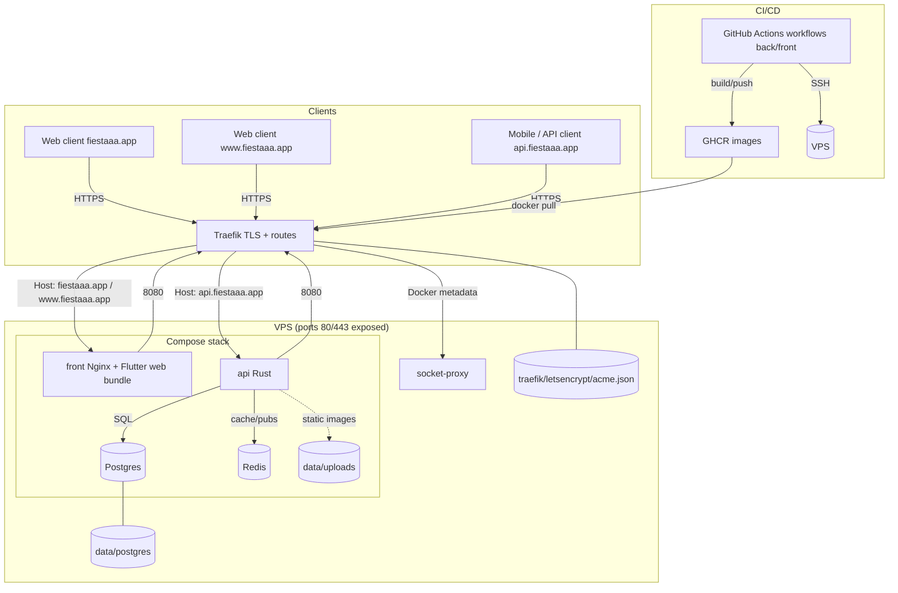

# Infrastructure Deployment (VPS) and CI/CD

Operational documentation to deploy `fiestaaa_back` (Rust API) and
`fiestaaa_front` (Flutter web frontend) on a VPS with Docker, Traefik, and
GitHub Actions (GHCR).

- Production stack described in `fiestaaa_back/docker-compose.prod.yml`
  (Traefik + socket-proxy + Postgres + Redis + API + Front).
- CI workflows: `fiestaaa_back/.github/workflows/ci.yml` and
  `fiestaaa_front/.github/workflows/ci.yml`.
- Manual release workflows: `fiestaaa_back/.github/workflows/deploy.yml` and
  `fiestaaa_front/.github/workflows/deploy.yml`.
- Image registry: `ghcr.io/theopeuchlestrade/{fiestaaa_back,fiestaaa_front}`.
  Frontend and backend are deployed with explicit SemVer tags (`vX.Y.Z`).
  The workflows also publish `latest`, but production compose should keep using
  explicit tags.
- In case of compromise or doubt about the VPS / secrets, also follow
  `fiestaaa_back/docs/incident-securite.md`.
- In case of a future move to `public + GitHub Free`, follow
  `fiestaaa_back/docs/passage-public-open-source.md`.

## Security Principles

- Production secrets are stored in GitHub Actions and materialized on the VPS in
  `~/apps/fiestaaa/.env` and `~/apps/fiestaaa/data/service-account.json` with
  strict permissions. Local `.env.prod` files are not the source of truth for
  production.
- Deployment workflows should use the GitHub `production` environment, with
  environment secrets, authorized branches, and manual approval if possible.
- The frontend no longer receives backend runtime secrets: its public
  configuration is injected only at build time.
- Traefik no longer accesses `/var/run/docker.sock` directly; it goes through a
  Docker proxy with limited read access.
- `FCM_SERVER_KEY` is optional and only used for the legacy FCM fallback. The
  production deployment uses FCM HTTP v1 and requires
  `FCM_SERVICE_ACCOUNT_JSON_B64` so GitHub Actions can materialize
  `service-account.json` on the VPS.
- PRs should pass a `dependency review`, and images pushed to GHCR should have a
  provenance attestation.
- While repositories remain `private + GitHub Free`, some prepared workflow
  protections remain inactive on GitHub. See
  `fiestaaa_back/docs/passage-public-open-source.md` for the future switch to
  `public + Free`.

## Architecture Overview



### Key Components

- Traefik: single reverse proxy, TLS (Let's Encrypt), redirects HTTP to HTTPS,
  routes `fiestaaa.app` and `www.fiestaaa.app` to service `front`, and
  `api.fiestaaa.app` to service `api`.
- socket-proxy: limited read-only exposure of the Docker API to Traefik on a
  dedicated internal Docker network; the Docker socket is no longer mounted
  directly into Traefik.
- front: Nginx container serving the Flutter web bundle (internal port 8080,
  exposed to Traefik through labels), without backend runtime secrets.
- api: Rust container (internal port 8080), depends on Postgres and Redis.
- Postgres + persistent volume `data/postgres`; Redis without persistence
  (current config).
- Avatar uploads: `data/uploads` volume mounted in the API container (exposed via
  `AVATAR_BASE_URL`, served by the API).
- Traefik certificates: `traefik/letsencrypt/acme.json` (chmod 600).
- CI/CD: GitHub Actions workflows (back/front) verify PRs and pushes to `main`.
  Manual release workflows version, tag, publish GHCR images, create GitHub
  releases, then deploy through SSH (`docker compose pull/up`). Image push uses
  `GITHUB_TOKEN`; the VPS only needs a read-only `GHCR_TOKEN`.
- VPS tree: `~/apps/fiestaaa` with `docker-compose.yml`, `data/`, `traefik/`,
  `data/service-account.json`, and optional `frontend/` for possible overrides.

## Automated Option: cloud-init + Ansible

To avoid preparing the VPS manually, the repository now provides a declarative
base in `infra/vps/`.

- `infra/vps/cloud-init.yml`: bootstrap for a fresh VPS (`deploy` user, Docker,
  UFW, Fail2ban, directory tree).
- `infra/vps/ansible/playbook.yml`: idempotent configuration of an existing or
  freshly created VPS.
- `infra/vps/ansible/inventory.example.yml`: inventory template to copy to a
  local untracked `inventory.yml`.
- `.github/workflows/provision-vps.yml`: manual playbook execution from GitHub
  Actions with `production` secrets.
- `.github/workflows/bootstrap-vps.yml`: first full Compose stack startup once
  the frontend image tag is known.

The recommended path for a new VPS is:

```bash
cp infra/vps/ansible/inventory.example.yml infra/vps/ansible/inventory.yml
ansible-playbook -i infra/vps/ansible/inventory.yml infra/vps/ansible/playbook.yml
```

The playbook copies `docker-compose.prod.yml` to
`~/apps/fiestaaa/docker-compose.yml`, prepares persistent directories, and keeps
secrets out of Git. GitHub Actions workflows remain responsible for generating
`~/apps/fiestaaa/.env` from `production` environment secrets.

For a blank machine without local Ansible:

1. Run the manual `Provision VPS` workflow.
2. Run `Frontend Release` in `fiestaaa_front` with `deploy_to_vps=false`
   (and `build_ios=false` if you only need the first web image).
3. Run `Bootstrap VPS Stack` in `fiestaaa_back` with the frontend release tag
   (for example `v1.0.0`) as `front_image_tag`.
4. Then use the normal manual release workflows.

See `infra/vps/README.md` for the short usage guide.

## 1) Prepare the VPS

> The manual steps below remain useful for understanding/debugging the server.
> For a new machine or one that must be brought back into compliance, prefer
> `infra/vps/`.

1. **Access**
   - Confirm the server IP and DNS (`fiestaaa.app`, `www.fiestaaa.app`, and
     `api.fiestaaa.app` point to the VPS so Traefik can generate certificates).
   - Verify SSH access: `ssh <user>@<ip>`.
2. **System Dependencies**
   ```bash
   sudo apt update
   sudo apt upgrade
   sudo apt install docker.io docker-compose-plugin  # Compose V2 (required)
   # If docker-compose v1 (python) is already installed, remove it to avoid
   # the "KeyError: 'ContainerConfig'" bug.
   sudo apt purge -y docker-compose || true
   sudo usermod -aG docker ${USER}  # then reconnect
   ```
   > If `docker-compose-plugin` does not exist in your repositories (for example
   > minimal cloud images), add the official Docker repository:
   > ```
   > sudo apt-get update
   > sudo apt-get install -y ca-certificates curl gnupg
   > sudo install -m 0755 -d /etc/apt/keyrings
   > curl -fsSL https://download.docker.com/linux/$(. /etc/os-release && echo "$ID")/gpg | sudo gpg --dearmor -o /etc/apt/keyrings/docker.gpg
   > echo "deb [arch=$(dpkg --print-architecture) signed-by=/etc/apt/keyrings/docker.gpg] https://download.docker.com/linux/$(. /etc/os-release && echo "$ID") $(. /etc/os-release && echo "$VERSION_CODENAME") stable" | sudo tee /etc/apt/sources.list.d/docker.list >/dev/null
   > sudo apt-get update
   > sudo apt-get install -y docker-ce docker-ce-cli containerd.io docker-buildx-plugin docker-compose-plugin
   > ```
3. **Deployment User (recommended)**
   ```bash
   sudo adduser deploy
   sudo usermod -aG docker deploy
   ```
4. **SSH Keys for GitHub Actions**
   - From the VPS (or your machine), generate a dedicated key:
     `ssh-keygen -t rsa -b 4096 -C "github-actions" -f /home/<user>/.ssh/deploy_key`
   - Add the public key to the server:
     `cat /home/<user>/.ssh/deploy_key.pub >> /home/<user>/.ssh/authorized_keys && chmod 600 /home/<user>/.ssh/authorized_keys`
5. **Non-Standard SSH Port (recommended)**
   ```bash
   SSH_PORT=1969  # adapt the value
   echo "Port ${SSH_PORT}" | sudo tee /etc/ssh/sshd_config.d/60-fiestaaa-port.conf >/dev/null
   # Ubuntu 24.04+ may use ssh.socket by default; switch back to ssh.service
   # so the Port directive is applied predictably.
   sudo rm -f /etc/systemd/system/ssh.service.d/00-socket.conf
   sudo rm -f /etc/systemd/system/ssh.socket.d/addresses.conf
   sudo systemctl disable --now ssh.socket
   sudo systemctl daemon-reload
   sudo systemctl enable --now ssh.service
   sudo /usr/sbin/sshd -t
   sudo systemctl restart ssh
   sudo ss -ltnp | grep ":${SSH_PORT}"
   ```
   - Keep the current SSH session open until a second connection
     `ssh -p <ssh_port> <user>@<ip>` has been validated.
   - Also update your local `~/.ssh/config` if you use an SSH alias.
   - If `ssh -p <ssh_port> ...` is refused while `ssh -p 22 ...` still works,
     `ssh.socket` is usually still listening on 22. The sequence above
     deliberately switches to `ssh.service` to avoid that behavior.
   - Changing the port mostly reduces automated scan noise; it does not replace
     SSH keys, UFW, and Fail2ban.
6. **Firewall**
   ```bash
   sudo apt install -y ufw
   sudo ufw allow <ssh_port>/tcp
   sudo ufw allow 80,443/tcp
   sudo ufw enable
   ```
   If you had already opened `22/tcp`, delete the rule after validating the new
   connection: `sudo ufw delete allow 22/tcp`.
7. **Fail2ban (SSH brute-force protection)**
   ```bash
   sudo apt install -y fail2ban
   sudo systemctl enable --now fail2ban
   ```
   Basic configuration (adapt `ignoreip` and the SSH port if needed):
   ```bash
   sudo tee /etc/fail2ban/jail.local >/dev/null <<'EOF'
   [DEFAULT]
   bantime = 1h
   findtime = 10m
   maxretry = 5
   ignoreip = 127.0.0.1/8 ::1 <your_static_ip>

   [sshd]
   enabled = true
   port = <ssh_port>
   backend = systemd
   banaction = ufw
   EOF
   sudo systemctl restart fail2ban
   ```
   `ignoreip` is the list of IPs/networks that are never banned (space
   separated). Add your public admin/VPN IP, and avoid `0.0.0.0/0`, which
   disables protection.

   Useful checks:
   ```bash
   sudo fail2ban-client status
   sudo fail2ban-client status sshd
   sudo tail -f /var/log/fail2ban.log
   ```
   If you finally keep port 22, replace `port = <ssh_port>` with `ssh` or `22`.

## 2) Prepare the VPS Directory Tree

The commands below assume a `/home/<user>/apps/fiestaaa` directory (adjust if
needed) and that GitHub Actions connects with this user. First copy the
repository `docker-compose.prod.yml` to the VPS (Git clone on the server or
`rsync` from your machine).

```bash
mkdir -p ~/apps/fiestaaa/{frontend,data/postgres,data/uploads,traefik/letsencrypt}
cp fiestaaa_back/docker-compose.prod.yml ~/apps/fiestaaa/docker-compose.yml
touch ~/apps/fiestaaa/traefik/letsencrypt/acme.json && chmod 600 ~/apps/fiestaaa/traefik/letsencrypt/acme.json
```

- **Expected COMPOSE_FILE**: the workflow runs `docker compose ...` without
  `-f`, hence the rename to `docker-compose.yml`.
- **Runtime secrets (.env)**: the CI workflow will generate `.env` on the server
  from GitHub secrets (see next section). This file remains in plaintext on the
  VPS; keep it `chmod 600` and reserve SSH access for admin/deploy. If you have
  stronger requirements, replace this mechanism with Docker secrets, SOPS/age,
  or a secret manager. For a first manual run, create it with placeholders:

  ```bash
  cat > ~/apps/fiestaaa/.env <<'EOF'
  # Immutable image tags required by docker-compose.yml
  API_IMAGE_TAG=<backend_image_tag>
  FRONT_IMAGE_TAG=<front_image_tag>
  # Database and cache
  POSTGRES_USER=...
  POSTGRES_PASSWORD=...
  POSTGRES_DB=...
  DATABASE_URL=postgres://<user>:<pass>@db:5432/<db>
  REDIS_URL=redis://redis:6379
  DATA_ENCRYPTION_KEY=...
  DATA_LOOKUP_KEY=...
  # Important: inside the Docker Compose network, use the service hostname
  # Redis ("redis") and not localhost; 6379 is the default port.
  # API
  JWT_SECRET=...
  APP_BASE_URL=https://fiestaaa.app
  AVATAR_BASE_URL=https://api.fiestaaa.app/media/avatars
  CORS_ALLOWED_ORIGINS=https://fiestaaa.app,https://www.fiestaaa.app
  ADMIN_EMAILS=admin@fiestaaa.app
  # Email / push (adapt as needed)
  INVITATION_EMAIL_SENDER="Fiestaaa <no-reply@fiestaaa.app>"
  RESEND_API_KEY=""
  # Optional: only if you keep a legacy FCM fallback
  FCM_SERVER_KEY="" # gitleaks:allow (empty placeholder in documentation)
  FIESTAAA_FCM_VAPID_KEY=""
  FCM_PROJECT_ID=""
  FIESTAAA_GOOGLE_WEB_CLIENT_ID=""
  FIESTAAA_GOOGLE_ANDROID_CLIENT_ID=""
  FIESTAAA_GOOGLE_IOS_CLIENT_ID=""
  FIESTAAA_APPLE_APP_ID=""
  FIESTAAA_APPLE_SERVICE_ID=...
  FIESTAAA_APPLE_REDIRECT_URI=...
  FCM_SERVICE_ACCOUNT_PATH=/app/service-account.json
  EOF
  ```

  Replace `<backend_image_tag>` and `<front_image_tag>` with tags that
  were actually published to GHCR, preferably release tags such as `v1.2.3`.
  Without both values, the production compose refuses to start to avoid any
  implicit fallback to `latest`.

- **Firebase service file**: GitHub Actions materializes
  `~/apps/fiestaaa/data/service-account.json` from
  `FCM_SERVICE_ACCOUNT_JSON_B64`. For a manual deployment, put the JSON there
  yourself, then apply `chown 10001:10001` and `chmod 400`.
- **Persistent data**:
  - Postgres: `./data/postgres` (volume `db`).
  - Avatar uploads: `./data/uploads` (volume mounted on `/data/uploads` by
    `api`).
  - Certificates: `./traefik/letsencrypt/acme.json`.

## 3) First Manual Startup (Optional)

From `~/apps/fiestaaa`:

```bash
docker compose pull        # retrieves ghcr.io/theopeuchlestrade/fiestaaa_back and fiestaaa_front images
docker compose up -d       # starts traefik, db, redis, api, front
docker compose ps          # checks statuses
docker compose logs -f api # debug if needed
```

## 4) GitHub Actions CI/CD (backend)

Workflow: `fiestaaa_back/.github/workflows/deploy.yml`

- Trigger: manual `workflow_dispatch`.
- Inputs: `release_type` (`patch`, `minor`, `major`, or `custom`),
  `custom_version` when using `custom`, and `deploy_to_vps`.
- Recommended GitHub environment: `production`
- Jobs:
  1. Verifies the release candidate (`cargo fmt`, `clippy`, full test suite,
     and a production Docker image build).
  2. Computes the next version from `Cargo.toml`, updates `Cargo.toml` /
     `Cargo.lock`, commits the version bump, and creates the annotated tag
     `vX.Y.Z`.
  3. Builds and pushes images
     `ghcr.io/theopeuchlestrade/fiestaaa_back:vX.Y.Z`,
     `ghcr.io/theopeuchlestrade/fiestaaa_back:X.Y.Z`, and `latest`.
  4. Creates the GitHub Release and provenance attestation linked to the GHCR
     image.
  5. Connects to the VPS over SSH (appleboy/ssh-action), then:
     - Generates `.env` on the server with GitHub secrets for the Docker Compose
       runtime, `TRUST_PROXY_HEADERS=true`, and `API_IMAGE_TAG=vX.Y.Z`.
     - Preserves the already deployed `FRONT_IMAGE_TAG`; the workflow fails
       explicitly if this tag has never been seeded on the VPS.
     - `docker compose pull api && docker compose up -d --no-deps traefik front api && docker compose ps`
       (stateful dependencies stay untouched).
  6. Runs blocking public smoke checks on `https://api.fiestaaa.app/health` and
     `https://fiestaaa.app`.
- Recommended PR workflow: `fiestaaa_back/.github/workflows/dependency-review.yml`.
  While the repository remains `private + GitHub Free`, it should skip cleanly;
  the GitHub action is really available only once the repository is public or
  the GitHub plan is upgraded.

### Secrets to Add in GitHub (Settings > Secrets and variables > Actions)

Name | Description
--- | ---
`JWT_SECRET` | JWT secret (32+ chars)
`METRICS_BEARER_TOKEN` | Bearer token used by Prometheus to scrape `/metrics`
`GRAFANA_ADMIN_PASSWORD` | Grafana admin password; Grafana is bound to VPS localhost only
`SENTRY_DSN` | Backend Sentry DSN for crash/error reporting
`VPS_HOST` | VPS IP or hostname
`VPS_PORT` | VPS SSH port (set the value configured in `sshd`, for example `1969`)
`VPS_USER` | Deployment user (for example `deploy`)
`VPS_SSH_KEY` | Content of the `deploy_key` private key (without passphrase)
`GHCR_TOKEN` | Minimal GitHub PAT with `read:packages` for VPS-side `docker login`
`DATABASE_URL` | Postgres URL used by the API (for example `postgres://<user>:<pass>@db:5432/<db>`)
`REDIS_URL` | Redis URL (for example `redis://redis:6379`, do not use `localhost` in Docker)
`DATA_ENCRYPTION_KEY` | Sensitive data encryption key in DB, at least 32 characters
`DATA_LOOKUP_KEY` | HMAC key used for blind indexes / lookups, at least 32 characters
`POSTGRES_USER` / `POSTGRES_PASSWORD` / `POSTGRES_DB` | Postgres variables used by service `db`
`APP_BASE_URL` | Public frontend URL (for example `https://fiestaaa.app`)
`CORS_ALLOWED_ORIGINS` | Allowed origin list (comma-separated)
`AVATAR_BASE_URL` | Public avatar URL (for example `https://api.fiestaaa.app/media/avatars`)
`AVATAR_UPLOAD_DIR` | Upload path in the API container (for example `/data/uploads/avatars`)
`INVITATION_EMAIL_SENDER` | Invitation email sender
`RESEND_API_KEY` | Resend email key
`FCM_SERVER_KEY` | (optional) Legacy FCM server key; leave empty if you use FCM HTTP v1 with `service-account.json`
`FCM_SERVICE_ACCOUNT_JSON_B64` | Required for production FCM HTTP v1; single-line base64 content of `service-account.json`, materialized as `~/apps/fiestaaa/data/service-account.json`
`FIESTAAA_FCM_VAPID_KEY` | VAPID public key (web push), reused by the frontend
`FCM_SERVICE_ACCOUNT_PATH` | Service key path (for example `/app/service-account.json`)
`FCM_PROJECT_ID` | Firebase project ID
`NOTIFICATION_DEDUP_TTL_SECONDS` | Notification deduplication TTL (for example 300)
`FIESTAAA_GOOGLE_WEB_CLIENT_ID` | Google OAuth web client ID
`FIESTAAA_GOOGLE_ANDROID_CLIENT_ID` | (optional) Google OAuth Android client ID
`FIESTAAA_GOOGLE_IOS_CLIENT_ID` | Google OAuth iOS client ID
`FIESTAAA_APPLE_APP_ID` | (optional) iOS/macOS bundle ID to verify native Apple tokens
`FIESTAAA_APPLE_SERVICE_ID` / `FIESTAAA_APPLE_REDIRECT_URI` | Apple OAuth (web), required if you want to display the Apple button (passed into generated `.env`)
`ADMIN_EMAILS` | (optional) Comma-separated admin email list

Optional variables:

- `SENTRY_ENVIRONMENT` (default `production`)
- `SENTRY_TRACES_SAMPLE_RATE` (default `0`)
- `GRAFANA_ADMIN_USER` (default `admin`)
- `POSTGRES_BACKUP_RETENTION_DAYS` (default `14`)
- `POSTGRES_BACKUP_INTERVAL_SECONDS` (default `86400`)
- `BACKUP_INCLUDE_FILES` (default `true`; set to `false` only for DB-only
  backup/restore drills)
- `BACKUP_INCLUDE_SECRETS` (default `false`; set only if the VPS backup
  location is protected enough to also store `.env` and `service-account.json`)

> Frontend values (VAPID, FCM project, Google client) are shared: set the same
> secrets in the `fiestaaa_front` repository to build the web bundle.

### Recommended GitHub Protection

- Create a `production` environment in GitHub on `fiestaaa_back` and
  `fiestaaa_front`.
- Move production secrets to the `production` `environment secrets`.
- Once repositories are public, protect `main` and make at least these checks
  required:
  - `Backend CI` on `fiestaaa_back/.github/workflows/ci.yml`
  - `Frontend CI` on `fiestaaa_front/.github/workflows/ci.yml`
  - `Dependency Review`
- While repositories remain `private + GitHub Free`, `Dependency Review` should
  remain present but only perform an explicit skip; the GitHub action is not
  available in this configuration.
- Add at least:
  - deployment branch restriction (`main`);
  - one or more `required reviewers` before execution;
  - if useful, a `wait timer` to avoid immediate deployment after merge.
- Also enable `secret scanning`, `push protection`, `dependency graph`,
  `Dependabot alerts`, and `Dependabot security updates`.

### VPS Expectations for CI to Work

- Target directory (`~/apps/fiestaaa`) contains `docker-compose.yml` (copy of
  `docker-compose.prod.yml`) and `data/`, `traefik/` directories.
- The user defined in `VPS_USER` can run `docker compose` without sudo and has
  Compose V2 (plugin). Avoid `docker-compose` v1 (known `KeyError:
  'ContainerConfig'` bug with recent Docker versions).
- The public key associated with `VPS_SSH_KEY` is in `~/.ssh/authorized_keys`.
- If SSH listens on a non-standard port, GitHub Actions `VPS_PORT` matches this
  port and UFW allows it.
- `~/apps/fiestaaa/.env`, `~/apps/fiestaaa/data/service-account.json`, and
  `~/apps/fiestaaa/traefik/letsencrypt/acme.json` are `chmod 600`.

### First Deployment on a Blank Machine

Normal workflows preserve the other service tag and intentionally fail if
`API_IMAGE_TAG` or `FRONT_IMAGE_TAG` does not yet exist. The first full launch
therefore goes through the manual `Bootstrap VPS Stack` workflow.

1. Provision the VPS with `Provision VPS` or local Ansible.
2. Publish a frontend image without deploying:
   - repo `fiestaaa_front`;
   - workflow `Frontend Release`;
   - `deploy_to_vps=false`;
   - `build_ios=false` if you only need the initial web image.
3. Note the published frontend release tag.
4. Repo `fiestaaa_back` -> workflow `Bootstrap VPS Stack` ->
   `front_image_tag=<frontend_release_tag>`.
5. Verify `docker compose ps`, `https://api.fiestaaa.app/health`, and
   `https://fiestaaa.app`.

### Validation

- Push to `main` -> verify the CI workflow is green.
- Manual release -> verify the release workflow is green and the tag/GitHub
  Release were created.
- On the VPS: run `docker compose ps`, then test `https://fiestaaa.app` and
  `https://api.fiestaaa.app/health` after deployment. If something goes wrong,
  use `docker compose logs -f api` and `docker compose logs -f front`.

## 5) Frontend (fiestaaa_front)

- Production compose expects explicit image tags:
  - `ghcr.io/theopeuchlestrade/fiestaaa_back:${API_IMAGE_TAG}` for the API
  - `ghcr.io/theopeuchlestrade/fiestaaa_front:${FRONT_IMAGE_TAG}` for the frontend
  Front and back workflows publish `latest` for convenience, but do not deploy
  through an implicit fallback:
  `API_IMAGE_TAG` and `FRONT_IMAGE_TAG` must be present in
  `~/apps/fiestaaa/.env`. Each release workflow updates its own release tag
  while preserving the other service tag so deployments and rollbacks remain
  auditable.
- GitHub workflow: `fiestaaa_front/.github/workflows/deploy.yml`
  - Recommended GitHub environment: `production`
  - Inputs: `release_type` (`patch`, `minor`, `major`, or `custom`),
    `custom_version` when using `custom`, optional `build_number`,
    `deploy_to_vps`, `build_ios`, and `ios_export_method`.
  - Steps: verify Flutter tests and web container build -> compute the next
    version from `pubspec.yaml` -> update `pubspec.yaml` -> commit and tag
    `vX.Y.Z` -> build + push web image (`vX.Y.Z`, `X.Y.Z`, `latest`) -> build
    signed Android APK and optional iOS IPA -> create the GitHub Release with
    mobile artifacts -> SSH VPS -> update
    `FRONT_IMAGE_TAG` in `~/apps/fiestaaa/.env` while preserving the already
    seeded `API_IMAGE_TAG` -> `docker compose pull front && docker compose up -d --no-deps front && docker compose ps` -> public smoke checks.
  - `~/apps/fiestaaa/frontend`: optional directory (no mounted volume). You can
    create it to host possible Nginx overrides or archives, but the frontend
    container is autonomous.
- Secrets to create on the `fiestaaa_front` repository (Settings > Secrets and
  variables > Actions):
  - VPS / registry access: `VPS_HOST`, `VPS_PORT` (SSH port configured on the
    VPS), `VPS_USER`, `VPS_SSH_KEY`, `GHCR_TOKEN` (minimal `read:packages` PAT
    for VPS pull).
  - Dart defines / Firebase / OAuth:
    `FIESTAAA_API_BASE_URL`, `FIESTAAA_GOOGLE_WEB_CLIENT_ID`,
    `FIESTAAA_APPLE_SERVICE_ID`, `FIESTAAA_APPLE_REDIRECT_URI`,
    `FIESTAAA_FCM_VAPID_KEY`, `FIESTAAA_SENTRY_DSN`, `FIREBASE_PROJECT_ID`,
    `FIREBASE_STORAGE_BUCKET`, `FIREBASE_MESSAGING_SENDER_ID`,
    `FIREBASE_WEB_API_KEY`, `FIREBASE_WEB_APP_ID`, optional
    `FIREBASE_WEB_MEASUREMENT_ID`, `FIREBASE_AUTH_DOMAIN` (otherwise
    `${project}.firebaseapp.com`).
  - Optional frontend variables:
    `FIESTAAA_SENTRY_ENVIRONMENT` (default `production`) and
    `FIESTAAA_SENTRY_TRACES_SAMPLE_RATE` (default `0`).
  - Secrets shared with the backend: `FIESTAAA_FCM_VAPID_KEY`,
    `FIESTAAA_GOOGLE_WEB_CLIENT_ID`, `FIREBASE_*`/`FCM_PROJECT_ID` must match
    backend values for notifications and OAuth to work.
- The values above are injected at build time (visible in the web bundle, normal
  for a public frontend).
- Deployment: the existing `docker-compose.yml` contains the `front` service; no
  extra VPS-side config is required. The `front` container no longer loads the
  production `.env` at runtime.
- Recommended PR workflow: `fiestaaa_front/.github/workflows/dependency-review.yml`
  to block vulnerable dependency introductions before merge. While the
  repository remains `private + GitHub Free`, it should skip cleanly; the GitHub
  action is really available only once the repository is public or the GitHub
  plan is upgraded.
- PR CI workflow: `fiestaaa_back/.github/workflows/ci.yml` for the backend
  (`cargo fmt`, `clippy`, dependency audit, full
  `cargo test --locked --all-targets --jobs 1 -- --test-threads=1`, and
  production container build) and `fiestaaa_front/.github/workflows/ci.yml` for
  the frontend (`flutter gen-l10n`, `dart format`, `flutter analyze`,
  `flutter test`, web container build, Android compile, and iOS compile on
  non-PR runs).

## 6) Runtime Checks and Observability

- API health: `curl -vk https://api.fiestaaa.app/health` (through Traefik).
- Database healthcheck: `docker compose exec db pg_isready -U ${POSTGRES_USER}`.
- Container healthchecks: `api` checks `http://127.0.0.1:8080/health`, `front`
  checks `http://127.0.0.1:8080/`.
- CORS: API-side authorizations through `CORS_ALLOWED_ORIGINS`
  (`https://fiestaaa.app,https://www.fiestaaa.app` in production).
- Front: `curl -I https://fiestaaa.app` and
  `curl -I https://www.fiestaaa.app`.
- HTTP redirect: `curl -I http://fiestaaa.app` and
  `curl -I http://api.fiestaaa.app` should return a permanent redirect to
  HTTPS.
- Stack up: `docker compose ps` (`socket-proxy`, `traefik`, `api`, `front`,
  `redis` must be Up, `db` healthy).
- Logs: `docker compose logs -f api`, `docker compose logs -f front`,
  `docker compose logs -f traefik`.

### Metrics and Dashboards

The production stack includes:

- Prometheus scraping the API `/metrics`, node-exporter, cAdvisor, and
  postgres-exporter.
- Loki + Promtail for searchable Docker logs with 14-day retention.
- Grafana provisioned with Prometheus/Loki datasources and the
  `Fiestaaa Overview` dashboard.

Grafana is deliberately bound to `127.0.0.1:3000` on the VPS, not exposed
through Traefik. Access it through an SSH tunnel:

```bash
ssh -L 3000:127.0.0.1:3000 deploy@<vps-host> -p <ssh-port>
```

Then open `http://127.0.0.1:3000` and sign in with
`GRAFANA_ADMIN_USER` / `GRAFANA_ADMIN_PASSWORD`.

The dashboard tracks:

- request volume, 5xx rate, and p95 API latency;
- auth, invitation, email, and push errors;
- registered users, pending registrations, new users over 24h/7d/30d,
  active users over 24h/7d/30d, active devices by platform, and linked OAuth
  accounts;
- disk availability, Postgres status/connections, and container restarts;
- recent warnings/errors from API, frontend, Traefik, and backup logs.

API metrics are protected by `METRICS_BEARER_TOKEN`; Prometheus reads the token
from `~/apps/fiestaaa/secrets/metrics_token`, owned by UID/GID `65534` because
the Prometheus container runs as `nobody`.

User metrics are refreshed in the API process every
`USER_METRICS_REFRESH_SECONDS` seconds (`300` by default). The `/metrics`
endpoint only exposes the last computed gauges, so Prometheus scrapes do not run
the user aggregation queries.

### External Uptime Checks

`fiestaaa_back/.github/workflows/uptime-monitor.yml` runs every 5 minutes from a
GitHub-hosted runner and checks:

- `https://fiestaaa.app`
- `https://api.fiestaaa.app/health`

GitHub workflow failures provide the basic alert. For push notifications to an
external channel, add `UPTIME_ALERT_WEBHOOK_URL` as a backend repository secret.

### Sentry

Backend Sentry is enabled by `SENTRY_DSN` in the backend production environment.
The API captures panics through the Sentry SDK and reports 5xx responses plus
selected email/push transport failures.

Frontend Sentry is enabled by `FIESTAAA_SENTRY_DSN` in the frontend production
environment and is injected at build time. The DSN is visible in the web bundle,
which is normal for Sentry browser clients.

## 7) Backups and Recovery

- Database: the `backup` container runs `scripts/backup_runtime.sh` every
  `POSTGRES_BACKUP_INTERVAL_SECONDS` seconds and writes custom-format dumps to
  `data/backups/postgres`.
- Uploads and certificates: the same script archives `data/uploads` and
  `traefik/letsencrypt/acme.json` to `data/backups/files`.
- Secrets: keep an off-VPS copy of GitHub Actions values, `service-account.json`,
  mobile keystores, and Apple/Google/Resend credentials in a secret vault. The
  local VPS backup can include `.env` and `service-account.json` only when
  `BACKUP_INCLUDE_SECRETS=true`.
- Restore drill: `fiestaaa_back/.github/workflows/backup-restore-drill.yml`
  runs weekly and executes `scripts/restore_drill_postgres.sh` on the VPS. It
  restores the latest dump into a disposable Postgres container and fails if no
  public tables are restored.
- Recovery: periodically test a full redeployment on a blank machine or a new
  VPS; the restore drill validates the DB dump, not the whole infrastructure.

Manual backup and restore commands from the VPS:

```bash
cd ~/apps/fiestaaa
./scripts/backup_runtime.sh
./scripts/restore_drill_postgres.sh
```

## 8) Migration Plan to Docker Secrets

Objective:

- reduce secret exposure in `~/apps/fiestaaa/.env`;
- isolate secrets by service;
- prepare easier rotation on the VPS.

Phase 1:

- keep public or low-sensitivity values as environment variables:
  `APP_BASE_URL`, `AVATAR_BASE_URL`, `CORS_ALLOWED_ORIGINS`, `FCM_PROJECT_ID`,
  `FIESTAAA_GOOGLE_*`, `FIESTAAA_APPLE_*`, `FIESTAAA_FCM_VAPID_KEY`.
- migrate first to secret files: `JWT_SECRET`, `DATABASE_URL`,
  `DATA_ENCRYPTION_KEY`, `DATA_LOOKUP_KEY`, `RESEND_API_KEY`,
  `POSTGRES_PASSWORD`, then possibly `GHCR_TOKEN` on the VPS side.

Phase 2:

- declare these secrets in `docker-compose.yml` with `secrets:`.
- for Postgres, use `POSTGRES_PASSWORD_FILE`.
- for the API, gradually add `*_FILE` reading as a fallback to environment
  variables.

Phase 3:

- replace full `.env` generation by GitHub Actions with generation or update of
  files in `~/apps/fiestaaa/secrets/`.
- restrict mounts to each service to the strict minimum.

Current state:

- this migration is not yet implemented in the application; the repository is
  ready to introduce it without changing the deployment architecture.

### Quick Stats (without Prometheus)

A simple script is available: `scripts/db_stats.sh`.

From the VPS:

```bash
cd ~/apps/fiestaaa
chmod +x scripts/db_stats.sh  # once if needed
./scripts/db_stats.sh
```

The script loads `.env`, builds the Postgres URL (`DATABASE_URL` or
`POSTGRES_*`), then reports:

- Accounts: users, events, invitations (by status), check-ins, active devices.
- Invitation distribution by status.
- Active device distribution by platform.
- New users per day (last 14 days).

## 9) Quick Checklists

### VPS Go-Live (infra)

- [ ] IP/DNS validated (`fiestaaa.app`, `www.fiestaaa.app`,
      `api.fiestaaa.app` -> VPS)
- [ ] `infra/vps/cloud-init.yml` applied on a fresh VPS or Ansible playbook run
- [ ] SSH OK, deployment user added to the docker group
- [ ] Non-standard SSH port configured and tested from a second session
- [ ] Docker + Docker Compose installed
- [ ] Dedicated SSH key created, public key in `authorized_keys`
- [ ] UFW opened on `<ssh_port>`/80/443
- [ ] `~/apps/fiestaaa` ready with `docker-compose.yml`, `.env`,
  `data/service-account.json`, `data/`, `traefik/`, `observability/`,
  `scripts/`, `secrets/metrics_token`
- [ ] `data/backups`, `data/prometheus`, `data/loki`, and `data/grafana`
  directories created with the expected service ownership

### GitHub Actions Go-Live (CI)

- [ ] Secrets `VPS_*`, `GHCR_TOKEN`, DB/Redis/JWT/URLs added
- [ ] GitHub `production` environment created on both repositories with
  protection rules
- [ ] GHCR PAT with only `read:packages` for VPS-side pull
- [ ] `secret scanning`, `push protection`, `Dependabot alerts`, and `security updates` enabled
- [ ] Back/front `ci.yml` workflows active on PRs
- [ ] `dependency-review.yml` workflows present; in `private + Free`, they must
  skip cleanly, then become active once repositories are public
- [ ] Provenance attestations enabled on release workflows
- [ ] Push to `main` triggers CI but not production deployment
- [ ] Manual Backend Release / Frontend Release workflows tested with a version
  tag and production environment approval
- [ ] Manual verification: `docker compose ps` on the VPS + public URLs reachable
- [ ] Front workflow active (`fiestaaa_front/.github/workflows/deploy.yml`) +
  frontend secrets filled
- [ ] Uptime monitor workflow active and alert destination configured if used
- [ ] Backup restore drill workflow green at least once
