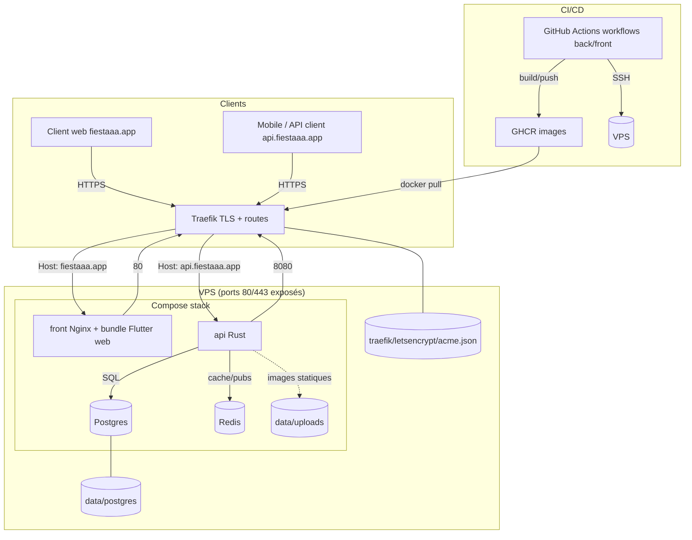

# Déploiement infra (VPS) et CI/CD

Documentation opérationnelle pour déployer les projets `fiestaaa_back` (API Rust) et `fiestaaa_front` (front Flutter web) sur un VPS à l'aide de Docker, Traefik et GitHub Actions (GHCR).

- Stack de prod décrite dans `fiestaaa_back/docker-compose.prod.yml` (Traefik + Postgres + Redis + API + Front).
- Pipeline CI existante côté backend : `fiestaaa_back/.github/workflows/deploy.yml`.
- Registre d'images : `ghcr.io/theopeuchlestrade/{fiestaaa_back,fiestaaa_front}` (tag `latest` + tag SHA).

## Vue d'ensemble de l'architecture



### Composants clés
- Traefik : reverse-proxy unique, TLS (Let’s Encrypt), routes `fiestaaa.app` → service `front`, `api.fiestaaa.app` → service `api`.
- front : conteneur Nginx servant le bundle Flutter web (port 80 interne, exposé à Traefik via labels).
- api : conteneur Rust (port 8080 interne), dépend de Postgres et Redis.
- Postgres + volume persistant `data/postgres`; Redis sans persistance (config actuelle).
- Uploads avatars : volume `data/uploads` monté dans le conteneur API (exposé via `AVATAR_BASE_URL`, servi par l'API).
- Certificats Traefik : `traefik/letsencrypt/acme.json` (chmod 600).
- CI/CD : workflows GitHub Actions (back/front) buildent et poussent les images sur GHCR puis déploient via SSH (`docker compose pull/up`).
- Arborescence VPS : `~/apps/fiestaaa` avec `docker-compose.yml`, `data/`, `traefik/`, `backend/service-account.json`, et optionnel `frontend/` pour éventuels overrides.

## 1) Préparer le VPS

1. **Accès**
   - Confirmer l'IP du serveur et les DNS (`fiestaaa.app`, `api.fiestaaa.app` pointent sur le VPS pour que Traefik puisse générer les certificats).
   - Vérifier l'accès SSH : `ssh <user>@<ip>`.
2. **Dépendances système**
   ```bash
   sudo apt update
   sudo apt upgrade
  sudo apt install docker.io docker-compose-plugin  # Compose V2 (requis)
  # Si docker-compose v1 (python) est déjà installé, le retirer pour éviter le bug "KeyError: 'ContainerConfig'"
  sudo apt purge -y docker-compose || true
  sudo usermod -aG docker ${USER}  # puis reconnectez-vous
  ```
   > Si `docker-compose-plugin` n'existe pas dans vos dépôts (ex. images cloud minimales), ajoutez le repo officiel Docker :  
   > ```
   > sudo apt-get update
   > sudo apt-get install -y ca-certificates curl gnupg
   > sudo install -m 0755 -d /etc/apt/keyrings
   > curl -fsSL https://download.docker.com/linux/$(. /etc/os-release && echo "$ID")/gpg | sudo gpg --dearmor -o /etc/apt/keyrings/docker.gpg
  > echo "deb [arch=$(dpkg --print-architecture) signed-by=/etc/apt/keyrings/docker.gpg] https://download.docker.com/linux/$(. /etc/os-release && echo "$ID") $(. /etc/os-release && echo "$VERSION_CODENAME") stable" | sudo tee /etc/apt/sources.list.d/docker.list >/dev/null
  > sudo apt-get update
  > sudo apt-get install -y docker-ce docker-ce-cli containerd.io docker-buildx-plugin docker-compose-plugin
  > ```
   > Note : récupérez l'API version du démon Docker (`docker version --format '{{.Server.APIVersion}}'`, ex. `1.52`) et, si besoin, ajoutez-la dans `~/apps/fiestaaa/.env` via `echo "DOCKER_API_VERSION=<valeur>" >> ~/apps/fiestaaa/.env` pour aligner Traefik.
3. **Utilisateur de déploiement (recommandé)**
   ```bash
   sudo adduser deploy
   sudo usermod -aG docker deploy
   ```
4. **Clés SSH pour GitHub Actions**
   - Depuis le VPS (ou votre machine), générer une clé dédiée :  
     `ssh-keygen -t rsa -b 4096 -C "github-actions" -f /home/<user>/.ssh/deploy_key`
   - Ajouter la clé publique au serveur :  
     `cat /home/<user>/.ssh/deploy_key.pub >> /home/<user>/.ssh/authorized_keys && chmod 600 /home/<user>/.ssh/authorized_keys`
5. **Pare-feu**
   ```bash
   sudo apt install -y ufw
   sudo ufw allow 22/tcp
   sudo ufw allow 80,443/tcp
   sudo ufw enable
   ```
6. **Fail2ban (protection brute-force SSH)**
   ```bash
   sudo apt install -y fail2ban
   sudo systemctl enable --now fail2ban
   ```
   Configuration de base (adapter `ignoreip` et le port SSH si besoin) :
   ```bash
   sudo tee /etc/fail2ban/jail.local >/dev/null <<'EOF'
   [DEFAULT]
   bantime = 1h
   findtime = 10m
   maxretry = 5
   ignoreip = 127.0.0.1/8 ::1 <votre_ip_fixee>

   [sshd]
   enabled = true
   port = ssh
   backend = systemd
   banaction = ufw
   EOF
   sudo systemctl restart fail2ban
   ```
   `ignoreip` est la liste des IPs/réseaux jamais bannis (séparés par des espaces). Ajoutez votre IP publique/VPN d'administration, et évitez `0.0.0.0/0` qui désactive la protection.
   Vérifications utiles :
   ```bash
   sudo fail2ban-client status
   sudo fail2ban-client status sshd
   sudo tail -f /var/log/fail2ban.log
   ```
   Si vous utilisez un port SSH non standard, remplacez `port = ssh` par le port réel (et ouvrez-le dans UFW).

## 2) Préparer l'arborescence sur le VPS

Les commandes ci-dessous supposent un dossier `/home/<user>/apps/fiestaaa` (ajustez si besoin) et que l'action GitHub se connecte avec cet utilisateur.
Copiez au préalable le `docker-compose.prod.yml` du repo vers le VPS (git clone sur le serveur ou `rsync` depuis votre machine).

```bash
mkdir -p ~/apps/fiestaaa/{backend,frontend,data/uploads,traefik/letsencrypt}
cp fiestaaa_back/docker-compose.prod.yml ~/apps/fiestaaa/docker-compose.yml
touch ~/apps/fiestaaa/traefik/letsencrypt/acme.json && chmod 600 ~/apps/fiestaaa/traefik/letsencrypt/acme.json
```

- **COMPOSE_FILE attendu** : le workflow lance `docker compose ...` sans `-f`, d'où le renommage en `docker-compose.yml`.
- **Secrets runtime (.env)** : le workflow CI générera le `.env` sur le serveur à partir des secrets GitHub (voir section suivante). Pour un premier run manuel, créez-le avec les placeholders :

  ```bash
  cat > ~/apps/fiestaaa/.env <<'EOF'
  # Base de données et cache
  POSTGRES_USER=...
  POSTGRES_PASSWORD=...
  POSTGRES_DB=...
  DATABASE_URL=postgres://<user>:<pass>@db:5432/<db>
  REDIS_URL=redis://redis:6379
  # Important : dans le réseau Docker Compose, utilisez le hostname du service
  # Redis ("redis") et non localhost ; 6379 est le port par défaut.
  # API
  JWT_SECRET=...
  APP_BASE_URL=https://fiestaaa.app
  AVATAR_BASE_URL=https://api.fiestaaa.app/media/avatars
  CORS_ALLOWED_ORIGINS=https://fiestaaa.app,https://www.fiestaaa.app
  METRICS_TOKEN=... # protège /metrics (Prometheus)
  # Email / push (adapter selon besoins)
  INVITATION_EMAIL_SENDER=Fiestaaa <no-reply@fiestaaa.app>
  RESEND_API_KEY=...
  FCM_SERVER_KEY=...
  FIESTAAA_FCM_VAPID_KEY=...
  FCM_PROJECT_ID=...
  FCM_SERVICE_ACCOUNT_PATH=/app/service-account.json
  # Monitoring (optionnel)
  GRAFANA_ADMIN_PASSWORD=...
  EOF
  ```

- **Fichier de service Firebase** : placez le JSON dans `~/apps/fiestaaa/backend/service-account.json` (non versionné, monté en read-only dans le conteneur API).
- **Données persistantes** :
  - Postgres : `./data/postgres` (volume `db`).
  - Uploads avatars : `./data/uploads` (volume monté sur `/data/uploads` par `api`).
  - Certificats : `./traefik/letsencrypt/acme.json`.

## 3) Premier démarrage manuel (optionnel)

Depuis `~/apps/fiestaaa` :
```bash
docker compose pull        # récupère les images ghcr.io/theopeuchlestrade/fiestaaa_back et fiestaaa_front
docker compose up -d       # lance traefik, db, redis, api, front
docker compose ps          # vérifie les statuts
docker compose logs -f api # debug si besoin
```

## 4) CI/CD GitHub Actions (backend)

Workflow : `fiestaaa_back/.github/workflows/deploy.yml`
- Déclencheurs : push sur `main` ou `master`, ou `workflow_dispatch`.
- Jobs :
  1. Vérifie la présence des secrets requis.
  2. `docker login` sur GHCR (`ghcr.io`).
  3. Build l'image `ghcr.io/theopeuchlestrade/fiestaaa_back:${{ github.sha }}` + `latest` (sauf si déjà présente).
  4. Push de l'image sur GHCR.
  5. Connexion SSH au VPS (appleboy/ssh-action) puis :
     - Génère `.env` sur le serveur avec les secrets (here-doc non quoté pour expanser les variables côté runner).
     - `docker compose pull api && docker compose up -d --no-deps api` (le reste de la stack doit déjà être présent grâce au compose prod).

### Secrets à ajouter dans GitHub (Settings > Secrets and variables > Actions)

Nom | Description
--- | ---
`JWT_SECRET` | Secret JWT (32+ chars)
`VPS_HOST` | IP ou hostname du VPS
`VPS_PORT` | Port SSH (optionnel, 22 par défaut)
`VPS_USER` | Utilisateur de déploiement (ex. `deploy`)
`VPS_SSH_KEY` | Contenu de la clé privée `deploy_key` (sans passphrase)
`GHCR_TOKEN` | PAT GitHub avec `write:packages` (push) et `read:packages` (pull côté VPS)
`DATABASE_URL` | URL Postgres utilisée par l'API (ex. `postgres://<user>:<pass>@db:5432/<db>`)
`REDIS_URL` | URL Redis (ex. `redis://redis:6379`, ne pas utiliser `localhost` dans Docker)
`POSTGRES_USER` / `POSTGRES_PASSWORD` / `POSTGRES_DB` | Variables Postgres utilisées par le service `db`
`APP_BASE_URL` | URL publique du front (ex. `https://fiestaaa.app`)
`CORS_ALLOWED_ORIGINS` | Liste des origines autorisées (séparées par virgules)
`AVATAR_BASE_URL` | URL publique des avatars (ex. `https://api.fiestaaa.app/media/avatars`)
`AVATAR_UPLOAD_DIR` | Chemin des uploads dans le conteneur API (ex. `/data/uploads/avatars`)
`METRICS_TOKEN` | Token pour protéger `/metrics` (Prometheus doit l'envoyer en Bearer)
`INVITATION_EMAIL_SENDER` | Expéditeur des emails d'invitations
`RESEND_API_KEY` | Clé d'email Resend
`FCM_SERVER_KEY` | Clé serveur FCM (notifications)
`FIESTAAA_FCM_VAPID_KEY` | VAPID public key (web push) — réutilisée par le front
`FCM_SERVICE_ACCOUNT_PATH` | Chemin vers la clé de service (ex. `/app/service-account.json`)
`FCM_PROJECT_ID` | ID du projet Firebase
`NOTIFICATION_DEDUP_TTL_SECONDS` | TTL de déduplication des notifications (ex. 300)
`FIESTAAA_GOOGLE_WEB_CLIENT_ID` | Client ID Google OAuth web
`FIESTAAA_GOOGLE_ANDROID_CLIENT_ID` | Client ID Google OAuth Android
`FIESTAAA_GOOGLE_IOS_CLIENT_ID` | Client ID Google OAuth iOS
`FIESTAAA_APPLE_APP_ID` | Bundle ID iOS/macOS pour vérifier les tokens Apple natifs
`FIESTAAA_APPLE_SERVICE_ID` / `FIESTAAA_APPLE_REDIRECT_URI` | OAuth Apple (web) — requis si vous voulez afficher le bouton Apple (transmis dans le `.env` généré)
`ADMIN_EMAILS` | (optionnel) Liste d'emails admin séparés par des virgules
`GRAFANA_ADMIN_PASSWORD` | (optionnel) Mot de passe Grafana si vous déployez la stack monitoring

> Les valeurs front (VAPID, FCM project, client Google) sont partagées : renseignez les mêmes secrets dans le repo `fiestaaa_front` pour la build du bundle web.
> Si vous activez `METRICS_TOKEN`, ajoutez-le aussi dans le `.env` généré par le workflow (`fiestaaa_back/.github/workflows/deploy.yml`) ou exportez-le côté VPS.
> `GRAFANA_ADMIN_PASSWORD` n'est utilisé que par la stack monitoring (pas par l'API).

### Attendus côté VPS pour que la CI fonctionne
- Le répertoire cible (`~/apps/fiestaaa`) contient `docker-compose.yml` (copie de `docker-compose.prod.yml`) et les dossiers `data/`, `traefik/`, `backend/`.
- L'utilisateur défini dans `VPS_USER` peut lancer `docker compose` sans sudo et dispose de Compose V2 (plugin). Éviter `docker-compose` v1 (bug connu `KeyError: 'ContainerConfig'` avec Docker récents).
- La clé publique associée à `VPS_SSH_KEY` est dans `~/.ssh/authorized_keys`.

### Validation
- Push sur `main` ➜ vérifier que le job "Build and Deploy" passe au vert.
- Sur le VPS : `docker compose ps` puis tester les URLs `https://fiestaaa.app` et `https://api.fiestaaa.app/health` après le déploiement.

## 5) Frontend (fiestaaa_front)

- L'image attendue par le compose prod est `ghcr.io/theopeuchlestrade/fiestaaa_front:latest` (bundle Flutter web servi par Nginx via `fiestaaa_front/Dockerfile`).
- Workflow GitHub : `fiestaaa_front/.github/workflows/deploy.yml`
  - Étapes : vérifie les secrets ➜ login GHCR ➜ build + push image (tags `${{ github.sha }}` + `latest`) ➜ SSH VPS ➜ `docker compose pull front && docker compose up -d --no-deps front`.
  - `~/apps/fiestaaa/frontend` : dossier optionnel (pas de volume monté). Vous pouvez le créer pour héberger d'éventuels overrides Nginx ou archives, mais le conteneur front est autonome.
- Secrets à créer sur le repo `fiestaaa_front` (Settings > Secrets and variables > Actions) :
  - Accès VPS / registre : `VPS_HOST`, `VPS_PORT` (optionnel), `VPS_USER`, `VPS_SSH_KEY`, `GHCR_TOKEN` (PAT avec write/read:packages).
  - Dart defines / Firebase / OAuth : `FIESTAAA_API_BASE_URL`, `FIESTAAA_GOOGLE_WEB_CLIENT_ID`, `FIESTAAA_APPLE_SERVICE_ID`, `FIESTAAA_APPLE_REDIRECT_URI`, `FIESTAAA_FCM_VAPID_KEY`, `FIREBASE_PROJECT_ID`, `FIREBASE_STORAGE_BUCKET`, `FIREBASE_MESSAGING_SENDER_ID`, `FIREBASE_WEB_API_KEY`, `FIREBASE_WEB_APP_ID`, optionnels `FIREBASE_WEB_MEASUREMENT_ID`, `FIREBASE_AUTH_DOMAIN` (sinon `${project}.firebaseapp.com`).
  - Partage de secrets avec le backend : `FIESTAAA_FCM_VAPID_KEY`, `FIESTAAA_GOOGLE_WEB_CLIENT_ID`, `FIREBASE_*`/`FCM_PROJECT_ID` doivent correspondre aux valeurs du backend pour que les notifications et OAuth fonctionnent.
- Les valeurs ci-dessus sont injectées au build (visibles dans le bundle web, normal pour un front public).
- Déploiement : le `docker-compose.yml` déjà en place contient le service `front`, aucune config supplémentaire côté VPS.

## 6) Monitoring (Prometheus/Grafana)

La stack monitoring est fournie dans `fiestaaa_back/docker-compose.monitoring.yml` avec un dashboard Grafana provisionné.

### Installation sur le VPS (exemple)
```bash
mkdir -p ~/apps/fiestaaa-monitoring
cp fiestaaa_back/docker-compose.monitoring.yml ~/apps/fiestaaa-monitoring/docker-compose.yml
cp fiestaaa_back/prometheus.yml ~/apps/fiestaaa-monitoring/prometheus.yml
cp -R fiestaaa_back/grafana ~/apps/fiestaaa-monitoring/grafana
```

### Variables requises
- `METRICS_TOKEN` : protège `/metrics` côté API (Prometheus doit l'envoyer en Bearer).
- `GRAFANA_ADMIN_PASSWORD` : mot de passe admin Grafana (requis par le compose monitoring).

Si la stack monitoring utilise le même `.env` que la prod (`~/apps/fiestaaa/.env`), ajoutez-y ces variables. Sinon exportez-les avant `docker compose up`.

### Accès aux métriques API
Le `prometheus.yml` par défaut scrape `host.docker.internal:8080` et inclut un `bearer_token`.

Option A (simple) : exposez l'API en loopback pour Prometheus (pas d'exposition publique) :
```yaml
services:
  api:
    ports:
      - "127.0.0.1:8080:8080"
```
Puis laissez `targets: ['host.docker.internal:8080']`.

Option B (réseau partagé) : créez un réseau Docker externe commun, attachez-y les deux compose et ciblez `api:8080` dans `prometheus.yml`.

### Lancement + accès
```bash
cd ~/apps/fiestaaa-monitoring
docker compose up -d
```
- Prometheus: `http://127.0.0.1:9090`
- Grafana: `http://127.0.0.1:3000` (user `admin`, password `GRAFANA_ADMIN_PASSWORD`)

Sur un VPS, utilisez un tunnel SSH pour accéder aux ports locaux :
```bash
ssh -L 3000:127.0.0.1:3000 -L 9090:127.0.0.1:9090 <user>@<ip>
```

## 7) Vérifications runtime

- Santé API : `curl -vk https://api.fiestaaa.app/health` (passe par Traefik) ou `docker compose exec api curl -f http://localhost:8080/health`.
- Metrics API : `curl -H "Authorization: Bearer $METRICS_TOKEN" http://127.0.0.1:8080/metrics`
- Healthcheck base : `docker compose exec db pg_isready -U ${POSTGRES_USER}`.
- CORS : autorisations côté API via `CORS_ALLOWED_ORIGINS` (`https://fiestaaa.app,https://www.fiestaaa.app` en prod).
- Stack up : `docker compose ps` (api doit être Up, db healthy, redis Up, traefik Up).

### Stats rapides (sans Prometheus)

Un script simple est disponible : `scripts/db_stats.sh`.

Depuis le VPS :
```bash
cd ~/apps/fiestaaa
chmod +x scripts/db_stats.sh  # une fois pour toutes si besoin
./scripts/db_stats.sh
```

Le script charge `.env`, construit l’URL Postgres (`DATABASE_URL` ou `POSTGRES_*`), puis remonte :
- Comptes : utilisateurs, événements, invitations (par statut), check-ins, devices actifs.
- Répartition des invitations par statut.
- Répartition des devices actifs par plateforme.
- Nouveaux utilisateurs par jour (14 derniers jours).

## 8) Checklists rapides

### MEP VPS (infra)
- [ ] IP/DNS validés (`fiestaaa.app`, `api.fiestaaa.app` ➜ VPS)
- [ ] SSH OK, utilisateur de déploiement ajouté au groupe docker
- [ ] Docker + Docker Compose installés
- [ ] Clé SSH dédiée créée, clé publique dans `authorized_keys`
- [ ] UFW ouvert sur 22/80/443
- [ ] Dossier `~/apps/fiestaaa` prêt avec `docker-compose.yml`, `.env`, `backend/service-account.json`, `data/`, `traefik/`

### MEP GitHub Actions (CI)
- [ ] Secrets `VPS_*`, `GHCR_TOKEN`, DB/Redis/JWT/URLs ajoutés
- [ ] PAT GHCR avec `write:packages` (push) et utilisable en pull côté VPS
- [ ] Push sur `main` déclenche la pipeline et le déploiement
- [ ] Vérification manuelle : `docker compose ps` sur le VPS + URLs publiques accessibles
- [ ] Workflow front actif (`fiestaaa_front/.github/workflows/deploy.yml`) + secrets front renseignés
